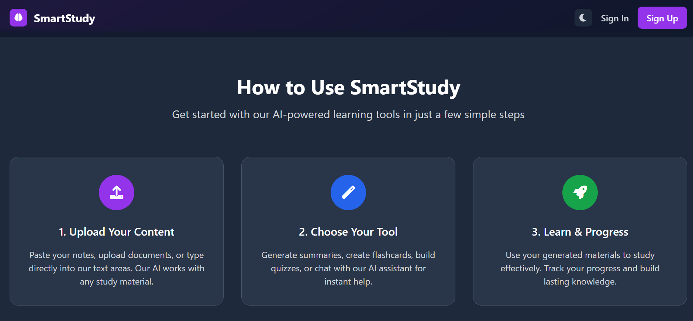
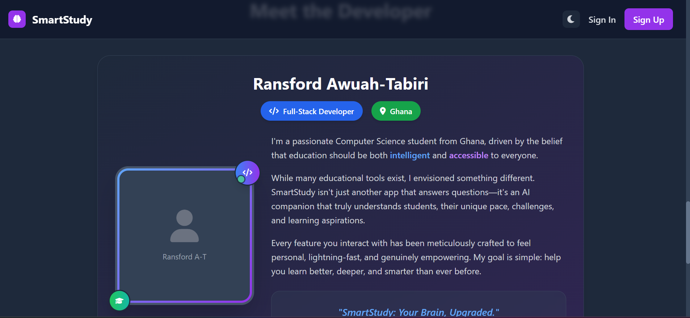
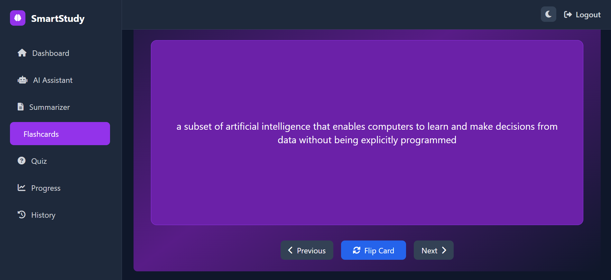

# SmartStudy

SmartStudy is a modern AI-powered educational web application built with Flask that helps students enhance their learning through intelligent study tools. The app provides local AI processing without external API keys, making it fully self-contained, cost-free, and privacy-focused.

---

## Overview

- Focus: Smart, fast, and privacy-respecting AI tools for learners  
- No External APIs: All AI runs locally, no keys or cloud needed  
- Modular Tools: Includes AI Assistant, Summarizer, Flashcards, Quiz System, and Activity Tracker  
- Self-tracking: Session-based data to track learning progress  
- Built With: Flask, Tailwind CSS, Vanilla JS  

---

## User Preferences

- Communication Style: Simple, everyday language  
- Privacy First: All features work locally with no user data sent outside  

---

## System Architecture

### Frontend Architecture

- Framework: HTML5 with Tailwind CSS for responsive UI  
- JavaScript: Vanilla JS for interactivity  
- Templates: Jinja2 for dynamic rendering  
- Styling: Dark theme with gradient purple/blue accents  
- Icons: Font Awesome  

### Backend Architecture

- Framework: Flask with RESTful routing  
- State Management: Session-based using Flask sessions  
- AI Engine: Local AIProcessor class — no external calls  
- Endpoints: JSON API + template-rendered views  

---

## Data Storage Strategy

| Layer        | Storage Used                   | Purpose                                 |
|--------------|--------------------------------|-----------------------------------------|
| Session      | Flask sessions                 | Track activity, quiz scores, history    |
| Browser      | localStorage                   | Save user preferences and progress      |
| File System  | Static files for CSS/JS/images | Asset management                        |
| Database     | None currently                 | (Planned for future updates)            |

---

## Key Components

### AI Processing Engine (`ai_processor.py`)

- Purpose: Local AI without API dependencies  
- Features:
  - Text summarization  
  - Educational quotes  
  - Quick academic Q&A  
  - Quiz generation (multi-subject)  
- Implementation:  
  - Rule-based logic  
  - Extractive summarization  
  - Interactive quiz system  
- Subjects Covered: Algebra, Geometry, Calculus, Chemistry, Biology, Literature, Programming  

### Web App Controller (`app.py`)

- Routes: Landing, Dashboard, AI Tools, Flashcards, Quiz, History  
- Session Logs: Track user stats, tool usage, and timestamps  
- Quiz Manager: Multi-subject quiz generation, scoring, and feedback  
- History Tracker: Summaries, quizzes, flashcards all logged  

---

## Frontend Components

| Component         | Description                                                                 |
|-------------------|-----------------------------------------------------------------------------|
| Landing Page      | Hero section with animated quotes and full navigation                      |
| Dashboard         | User hub with stats and quick access to tools                              |
| AI Assistant      | Chat interface with quick questions and full chat history                  |
| Summarizer        | Input box for notes, returns AI-generated summary + log                    |
| Flashcards        | Interactive study cards + saved sessions                                   |
| Quiz System       | Multi-subject tests with difficulty, explanations, and scoring             |
| Activity History  | Timeline of all summaries, questions, and study actions                    |

---

## Data Flow Overview

### User Interaction Flow

1. Landing Page: Quotes & navigation  
2. Dashboard: Stats and feature cards  
3. Tool Use: Summarizer, Quiz, Flashcards, Assistant  
4. Logging: Session logs activities  
5. History: Filter, clear, or review study history  

### AI Processing Flow

1. Input: Text or quiz selection  
2. Processing: Local AI logic processes request  
3. Response: Summaries, quizzes, or answers returned  
4. Log: Session stores results with timestamps  

---

## External Dependencies

### Frontend

- Tailwind CSS — Rapid styling via CDN  
- Font Awesome — Icons  
- Chart.js — Progress tracking charts  

### Backend

- Flask — Web framework  
- Python standard libraries (no external AI libraries)  

---

## No External APIs

All features are processed locally.

- No API Keys Needed  
- Zero Usage Costs  
- Full Privacy Control  
- Limited to basic AI functionality  

---

## Deployment Strategy

### Development

- Run locally using:
  ```bash
  python app.py


## 📸 Screenshots

### 🏠 Landing Page
The initial welcome screen showcasing the platform’s name, tagline, and call-to-action button to explore or get started.


---

### 📘 How to Use Section
A step-by-step instructional section that guides users on how to navigate and use the platform effectively.



---

### 👨‍💻 About the Developer
A brief profile of the developer behind the project, including background, motivation, and links to portfolios or social accounts.



---

### 📝 Signup Page
Users can create a new account by entering their details. The form is clean, minimal, and secure.


---

### 🔐 Signin Page
Returning users can log in to their account using email and password with authentication handling in place.


---

### 📊 Dashboard
The personalized dashboard showing study stats, active tools, and recent learning activities after login.


---

### 🤖 AI Assistant
An AI-powered chatbot that helps users ask academic questions, receive assistance, and interact with personalized learning tips.


---

### ✂️ AI Summarizer
Tool that allows users to paste content and receive short, AI-generated summaries for better understanding and revision.


---

### 🧠 Flashcards - View 1
A learning tool that helps users memorize key terms and definitions interactively.


---

### 🧠 Flashcards - View 2
An alternate layout or mode for flashcards, optimized for rapid self-testing and retention.



---

### ❓ Quiz Section
Interactive quiz module where users can test their understanding of studied material with instant feedback.


---

### 📈 Learning Tracker
Tracks user activity, completion progress, and engagement with different study tools.


---

### 📚 Study History
A log of all previous learning sessions, quiz attempts, and tool usage — helping users reflect and revisit.


